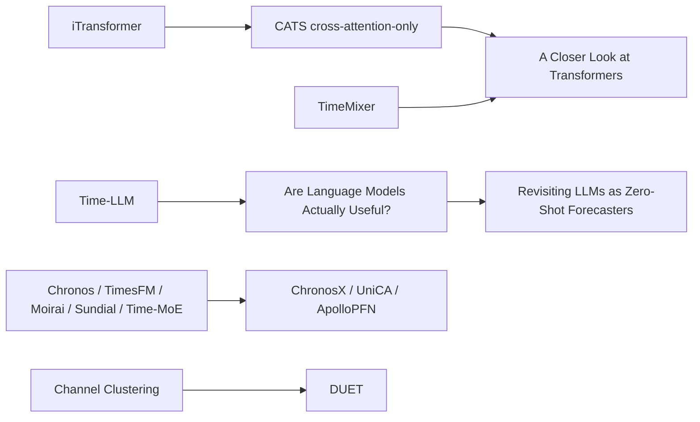

# Time Series Forecasting Literature Since January 2024

## Executive summary

The literature since January 2024 splits into two very different streams. One stream chases **stronger general forecasting backbones** through architectural simplification, multiscale pattern extraction, or large-scale pretraining; this includes iTransformer, TimeMixer, TimeMixer++, Chronos, Moirai, TimesFM, Time-MoE, Sundial, and Timer. The other stream is much smaller and much more relevant to your project: it studies **how to use exogenous covariates, cluster channels, or adapt pretrained models to covariates**. In that second stream, the most important papers for your design are **TimeXer**, **From Similarity to Superiority: Channel Clustering for Time Series Forecasting**, **DUET**, **ChronosX**, **UniCA**, **ApolloPFN**, and, as a lighter-weight structural precursor, **CATS: Constructing Auxiliary Time Series as Exogenous Variables**. These papers collectively validate asymmetric target/covariate modeling, channel clustering, covariate adapters, and robustness benchmarking, but they do **not** solve your central problem of **query-dependent sparse covariate selection with faithful attribution under heavy correlation and changing covariate sets**. That gap remains materially open. citeturn16view0turn17view0turn16view2turn29view0turn35view0turn36view0turn27view1turn21view0turn20view1turn31view0turn20view2turn20view3turn38search2turn32search0turn31view1turn33search0

For your project specifically, the strongest positive evidence supports three claims. First, **cluster-first handling of correlated channels/covariates is promising**: Channel Clustering explicitly groups similar channels and reports both performance and interpretability gains, while DUET extends this to dual clustering over time and channels and adds soft clustering plus sparsification. Second, **endogenous and exogenous series should usually not be treated symmetrically**: TimeXer’s endogenous/exogenous split and bridge token are one of the clearest successful design patterns in this period. Third, **foundation models are not the main story for your setting**: later covariate papers repeatedly note that leading TSFMs often ignore exogenous covariates or need adaptation modules, which is exactly why ChronosX, UniCA, and ApolloPFN exist. citeturn17view0turn16view2turn16view0turn29view0turn35view0turn36view0turn15view3

The literature is also notably weak on several axes that matter most to you. In the set I reviewed, I did **not** find a well-cited or top-venue 2024–2026 forecasting paper that directly combines **query-conditioned sparse exogenous selection**, **hierarchical cluster→feature gating**, **α-entmax or hard-concrete selection for forecasting covariates**, **cluster-level attribution**, **diversity regularization over correlated macro series**, and **stability estimates such as MC-dropout selection frequency**. That means your proposed architecture is not merely a recombination of obvious prior art; it is a plausible and still-distinct research direction grounded in adjacent evidence rather than already-solved design templates. citeturn16view0turn17view0turn16view2turn29view0turn35view0turn36view0turn27view1turn14view0

A final caution: papers that rely on attention or cross-attention for routing covariates should not be read as having solved **faithful feature importance**. Outside forecasting, the classic “Attention is not Explanation” result found that attention weights are often weakly aligned with gradient-based importance and that very different attention distributions can yield similar predictions, while the rebuttal “Attention is not not Explanation” argued that usefulness depends on the definition of explanation and on stronger diagnostics. For your project, that supports your instinct to treat routing weights as **proxies**, and to pair them with **weight×gradient**, cluster aggregation, and stability diagnostics rather than raw attention plots alone. citeturn40view0turn40view1

## Scope and selection logic

I treated a paper as part of the main review if it met at least one of two conditions: it was **published in a strong venue during 2024–2026** or it had already become **visibly influential by mid-2026** through substantial citation uptake on the paper’s indexed landing page. I keyed inclusion by **archival publication date when available**, which is why some preprints first posted in late 2023 still appear here: for example, iTransformer is an **ICLR 2024 Spotlight**, Timer is an **ICML 2024 poster**, and TimesFM was explicitly noted by Google Research as **accepted at ICML 2024**. citeturn22search4turn33search15turn34search4

Because your clarified goal is **not** “generic forecasting” but rather **shared target/covariate encoders plus query-dependent sparse covariate selection under strong feature correlation**, I separate the literature into two layers. The first layer covers **broadly influential forecasting papers** that define the field backdrop. The second layer, which I weight more heavily, covers papers that touch at least one of your decisive design constraints: exogenous-variable modeling, channel clustering, sparsification, covariate-aware adaptation, interpretability, or robustness under variable covariate availability. That is why TimeXer, Channel Clustering, DUET, ChronosX, UniCA, ApolloPFN, CATS-ATS, and CauAir receive the most detailed project-facing discussion below. citeturn16view0turn17view0turn16view2turn29view0turn35view0turn36view0turn27view1turn14view0

The citation counts below are best read as **approximate mid-2026 indicators**, because different landing pages surface different indexes. Where no count was visible on the reviewed paper page or search result, I mark it as **unspecified** rather than guessing. citeturn22search5turn9search1turn38search13turn33search11turn34search3turn32search0turn28search0turn37search13

## Comparison of the most relevant papers for your project

| Paper | What is genuinely new | General impact | Strength of results | Generalizability | Project relevance |
|---|---|---|---|---|---|
| **TimeXer** citeturn9search1turn16view0 | Asymmetric endogenous/exogenous modeling with patch-wise self-attention for endogenous series, variate-wise cross-attention for exogenous series, plus a global endogenous bridge token. | NeurIPS 2024; about **667** citations surfaced on the venue/indexed page by mid-2026; code released. | Stronger than average for this niche: **12 real-world benchmarks**, generality and scalability studies, plus tests for missing values and mismatched lookback lengths. | Good on irregularity and missingness, but not a strong stress test for very large, changing macro covariate pools. | **High**. Strong support for asymmetric target/covariate encoders. Handles exogenous inputs well. Does **not** solve correlated-covariate stability, hierarchy, or faithful importance. |
| **From Similarity to Superiority: Channel Clustering** citeturn18search17turn17view0turn18search13 | Dynamic **channel clustering** that balances channel-independent and channel-dependent strategies and reports interpretability benefits. | NeurIPS 2024; about **95** citations; authors span **Yale, Kumo.AI, Max Planck Institute, and Stanford**. | Strong for a structural method: reports average gains of **2.4%** and **7.2%** in different forecasting settings and shows zero-shot usefulness. | Better than most backbone papers on transfer and unseen-series behavior, though still framed around channels within a forecasting instance rather than arbitrary external covariate banks. | **High**. Best direct support for your idea that cluster-level routing is more stable than feature-level routing under correlation. No query-dependent selection, no attribution recipe. |
| **DUET** citeturn37search13turn16view2turn37search10 | **Dual clustering** across temporal distributions and channels; adds **channel-soft-clustering** and sparsification in the channel module. | KDD 2025; about **259** citations; ECNU-led and quickly adopted in follow-up work. | Very strong empirical package: **25 datasets from 10 domains** and explicit handling of temporal heterogeneity plus channel complexity. | Better than average because it tests cross-domain heterogeneity, but still does not target task-dependent exogenous-variable availability. | **Very high**. The clearest recent support for a cluster-first architecture with soft cluster assignment and sparsification under noisy/complex correlations. Still missing query-conditioning and faithful cluster attribution. |
| **ChronosX** citeturn28search0turn29view0 | Modular covariate adapters that inject past and future covariates into pretrained TSFMs without redesigning the backbone. Also introduces a **32-dataset synthetic covariate benchmark**. | AISTATS 2025; about **25** citations; Amazon-led follow-up to Chronos. | Stronger than many adaptation papers because it pairs real-data results with a dedicated synthetic benchmark to isolate covariate effects. | Good for adaptation across pretrained backbones, but not built for large sparse selection over 50–1000 covariates. | **High**. Excellent evidence that pretrained backbones need explicit covariate adaptation, but it is adapter-based rather than sparse selection–based. |
| **UniCA** citeturn35view0turn15view2 | **Covariate homogenization** for heterogeneous covariates followed by unified pre/post-attention fusion into TSFMs. | ICLR 2026 poster; citations still **unspecified** because of recency; authors from **Nanjing University** and **Ant Group**; code released. | Good breadth: multiple unimodal and multimodal covariate-aware benchmarks, with classic, pretrained, and specialized baselines. | Strong on heterogeneity of covariate types, weaker on sparse faithful variable selection. | **High** for shared-embedding thinking, **medium** for your exact selector problem. Good if your covariates become heterogeneous or multimodal later. |
| **ApolloPFN** citeturn36view0turn15view3 | Time-aware prior-fitted network for zero-shot forecasting with exogenous covariates; adds synthetic prior generation tailored to temporal structure and exogenous dependence. | TMLR page shows **decision pending** as of June 23, 2026; citations **unspecified**; authors from **Amazon** and **NYU**. | Particularly interesting because the revision log shows later claim moderation, added baselines, added ablations, and added perturbation/coverage analyses after reviewer feedback. | Potentially strong because it explicitly aims at zero-shot with exogenous variables and tests several applications, but publication status is still pending. | **High but emerging**. Useful for data generation, covariate robustness, and benchmarking design; less useful as a direct sparse-selector blueprint. |
| **CATS: Constructing Auxiliary Time Series as Exogenous Variables** citeturn18search4turn27view1turn18search8 | Builds **auxiliary time series** that summarize inter-series relationships and acts like a sparse temporal-contextual attention mechanism, even with a 2-layer MLP predictor. | ICML 2024; about **49** citations; code released. | Convincing for a compact method and explicitly argues for continuity, sparsity, and variability in auxiliary series. | Reasonably transferable, but more about constructing synthetic exogenous representations than selecting among large real covariate pools. | **Medium-high**. Useful conceptual cousin to your “cluster as latent factor” idea. Less aligned with your query-dependent selector requirement. |
| **CauAir** citeturn13search7turn14view0turn13search19 | Domain-specific causal learning model that explicitly models causal association between weather covariates and AQI and introduces a nationwide dataset. | IJCAI 2025; about **12** citations; code and dataset released. | Solid within its domain and notably efficient; less broad than the best general methods. | Good domain realism, weak breadth beyond air-quality forecasting. | **Medium**. Relevant as evidence that explicit causal covariate structure matters, but too domain-specific to serve as your main blueprint. |

Two patterns stand out from this comparison. The papers that are **best aligned** with your project are not the highest-cited general forecasters; they are the ones that either **cluster correlated variables** or **treat covariates as first-class citizens** rather than as afterthoughts. Channel Clustering and DUET are the strongest evidence for your cluster-first direction, TimeXer is the best evidence for asymmetric target/covariate handling, and ChronosX/UniCA/ApolloPFN are the best evidence that exogenous adaptation remains a major unsolved limitation of otherwise-strong pretrained forecasters. citeturn17view0turn16view2turn16view0turn29view0turn35view0turn36view0

Just as important is what these papers **do not** give you. None of the top project-relevant papers above gives you a mature answer for **query-conditioned selection over hundreds of changing covariates**, **hierarchical cluster→feature gates conditioned on target embedding, target-cluster embedding, and horizon embedding**, or **cluster-level attribution using something like cluster-mass × gradient**. That means your intended contribution is not merely incremental “paper stitching”; it addresses a still-open design point between forecasting, structured selection, and faithful explanation. citeturn16view0turn17view0turn16view2turn29view0turn35view0turn36view0

## Critical reading of the broader field against your architecture

The broader 2024–2026 forecasting literature is dominated by two kinds of high-impact papers. One kind argues that **simple or reoriented architectures work surprisingly well**: iTransformer became one of the most cited recent forecasting papers and argued that variables should be tokens; TimeMixer proposed multiscale MLP mixing; TimeMixer++ broadened this into a general pattern machine; and the NeurIPS paper “Are Self-Attentions Effective for Time Series Forecasting?” proposed a cross-attention-only CATS architecture that removes self-attention. The later ICML 2025 analysis “A Closer Look at Transformers for Time Series Forecasting” then argued that intra-variate information, normalization, and skip connections explain much of the observed success, and that standard benchmarks understate real-world difficulty. citeturn22search5turn21view0turn20view1turn31view0turn18search2turn27view0turn7view1

That broader lesson is good news for your proposal. It suggests you do **not** need a massive foundation model or deeply exotic architecture to make progress. Instead, a compact architecture with the *right inductive bias* around external covariates may be enough. I would read this body of work as supporting a design principle like: **keep the forecasting backbone simple, and spend your modeling budget on the covariate selector**. TimeXer, Channel Clustering, and DUET all fit that reading better than generic TSFMs do. citeturn16view0turn17view0turn16view2turn7view1

The second dominant stream is the **foundation-model wave**. Chronos, Moirai, TimesFM, Timer, Time-MoE, and Sundial all became important because they showed that large-scale pretraining can deliver impressive zero-shot or near-zero-shot forecasting across many domains. Chronos tokenizes values and trains T5-style models on **42 datasets**; Moirai trains on **LOTSA with over 27B observations across nine domains**; TimesFM reports pretraining on **100B time points**; Time-MoE scales sparse MoE pretraining to **2.4B parameters** with **Time-300B**; and Sundial introduces a continuous-valued generative objective with **one trillion time points**. These are major field-shaping results. citeturn20view2turn20view3turn38search2turn33search1turn32search6turn31view1

But once your design target is narrowed to **external covariates with high redundancy and variable availability**, the relevance of this TSFM wave drops. ChronosX says the “majority” of pretrained forecasting models do not readily use covariates and introduces adapters to fix that. UniCA says TSFMs mainly target real-valued series and struggle with general covariate-aware forecasting. ApolloPFN goes further and explicitly states that many current TSFMs ignore exogenous covariates, motivating a new model family built around them. I therefore agree with your updated judgment: **TS foundation models are background context, not the center of gravity for your project**. They matter mainly as backbones to adapt or baselines to beat, not as direct blueprints for sparse covariate selection. citeturn29view0turn35view0turn36view0

The LLM-for-forecasting substream also deserves a more skeptical treatment than it often receives. Time-LLM claimed strong performance and few-shot/zero-shot benefits at ICLR 2024, but the NeurIPS 2024 paper “Are Language Models Actually Useful for Time Series Forecasting?” later argued that removing or replacing the LLM component often does not hurt and can improve performance, while the ACL 2025 paper “Revisiting LLMs as Zero-Shot Time Series Forecasters” found sensitivity to small noise and weak robustness in zero-shot settings. For your problem, I would treat this literature as mostly **low relevance** unless you specifically want in-context retrieval from external documents or multimodal metadata. citeturn24view0turn23search5turn24view1

On interpretability, the biggest gap between the forecasting literature and your proposed system is that routing and explanation are routinely conflated. TimeXer, UniCA, and many adapter/fusion papers use attention-like mechanisms to inject covariates, but they do not establish that the resulting weights are faithful per-feature importance measures. The older attention-explainability debate is therefore still highly relevant: one side finds standard attention weights poor as explanations, while the other side argues they can be made more meaningful with better diagnostics. For your system, the right takeaway is not “never use attention,” but rather “**never report raw selection weights as if they were causal importance**.” Your proposal to use **weight×gradient**, cluster-level aggregation, and stochastic stability is well aligned with that caution. citeturn16view0turn35view0turn40view0turn40view1

There is also an architectural inference worth making from the “A Closer Look” paper. That paper finds that **skip connections** and normalization contribute substantially to forecasting performance on current benchmarks. I infer from that result that, if your goal is to make the selector consequential and interpretable, you should indeed **avoid a residual bypass around the selector**. Otherwise the model may learn to win via the bypass while leaving the selector’s sparse pattern only weakly coupled to the forecast. This is not a direct recommendation from that paper, but it is a reasonable design inference from its findings. citeturn7view1

## Influence and rebuttal map

The most important response structure in this literature is not a clean linear chain of citations, but a set of **debate arcs**: simple backbones versus more complex ones, LLM-based forecasting versus skeptical ablations, and TSFMs versus covariate-aware adaptation layers. The diagram below is best read as a conceptual influence-and-response map rather than a strict formal citation graph. citeturn24view0turn23search5turn24view1turn16view0turn17view0turn16view2turn29view0turn35view0turn36view0turn7view1

Three lines in that map matter most for your project. The **Channel Clustering → DUET** line is the most supportive of hierarchical, cluster-first design. The **Chronos / TimesFM / Moirai / Sundial / Time-MoE → ChronosX / UniCA / ApolloPFN** line shows that even strong pretrained models still need explicit covariate-aware adaptation. And the **Time-LLM → Are Language Models Actually Useful? → Revisiting LLMs as Zero-Shot Forecasters** line shows how quickly headline forecasting claims can soften under ablation and robustness analysis. citeturn17view0turn16view2turn29view0turn35view0turn36view0turn24view0turn23search5turn24view1

## What the literature says about your concrete design choices

Your idea of a **shared self-supervised encoder for both targets and covariates** is directionally supported but not directly matched by a flagship paper in this window. TimeXer and UniCA both argue for careful representation alignment between targets and external variables, while ChronosX and ApolloPFN show that injecting covariates into strong pretrained temporal representations is effective. What is still missing is the exact design you want: a shared encoder trained independently of the forecasting head and then used to support target-conditioned sparse retrieval/routing over hundreds of covariates. That looks like a real novelty point, not a standard recipe. citeturn16view0turn35view0turn29view0turn36view0

Your **hierarchical cluster→feature selector** is well supported indirectly. Channel Clustering says grouping similar channels can improve generalization and interpretability, and DUET says dual clustering helps when both temporal heterogeneity and channel correlation matter. CATS-ATS adds a related idea by constructing a compressed auxiliary representation that behaves like a sparse relational summary. Taken together, these papers materially support your decision to identify **latent macro factors first** and only then select features inside them. citeturn17view0turn16view2turn27view1

Your preference for **α-entmax over brittle hard binary gates** is also plausible, but here the literature gives you less direct guidance than you might expect. In the reviewed 2024–2026 forecasting set, the stronger papers on exogenous variables and clustering generally use attention, soft clustering, or adapters rather than entmax/hard-concrete variable gates. That means if you choose entmax for stability and hardware simplicity, you are not following a dominant TSF tradition so much as importing a sensible sparse-selection tool into a gap area. That is defensible, but the literature support is **adjacent rather than direct**. citeturn16view0turn16view2turn35view0

Your proposed **cluster-level attribution** is one of the clearest opportunities in the whole space. Channel Clustering says clusters improve interpretability, but it does not give a strong faithful attribution mechanism. DUET performs clustering and sparsification, but not cluster importance in the explanation sense you care about. TimeXer provides covariate-routing behavior, but not faithful covariate importance. Because raw attention-style weights are not enough, your idea to report **cluster mass**, **cluster sensitivity**, and then within-cluster representatives is more methodologically mature than what most current forecasting papers do. citeturn17view0turn16view2turn16view0turn40view0turn40view1

Your instinct to add **diversity regularization** also looks well motivated by omission: recent exogenous and clustering papers acknowledge noisy or redundant channels, but I did not find a highly cited top-venue forecasting paper in this period that turned diversity over selected covariates into a first-class regularizer for interpretability and robustness. DUET’s channel sparsification and CauAir’s coarse causal association are the nearest neighbors conceptually, but neither is a full diversity-aware selector over large macro pools. citeturn16view2turn14view0

Finally, your use of **MC-dropout stability** as a cheap confidence layer for selection looks more forward-looking than mainstream. The closest strong analog I found is ApolloPFN’s revision process, which added perturbation and coverage analyses after review, showing that reviewers are increasingly asking for robustness diagnostics around covariate-aware forecasting. That makes your plan to report activation frequency and importance variance across stochastic passes look timely and methodologically well judged. citeturn36view0

## Omitted but still relevant works

Several papers are relevant enough to know, but I would not put them at the center of your project review.

The most important omitted **foundational baselines outside the date window** are **TFT**, **TiDE**, **N-BEATSx**, **PatchTST**, and **LTSF-Linear / Are Transformers Effective for Time Series Forecasting?** TimeXer explicitly situates itself against TFT, NBEATSx, and TiDE, and the entire 2024 simplification wave still reacts to the earlier “linear baselines can beat fancy transformers” challenge. These are intellectually essential, but they fall outside your requested time window. citeturn16view0turn18search22

Among **adjacent 2025–2026 papers**, I would keep an eye on **TSGym**, **COSMIC**, **TimeSeed**, and **Time Series Forecasting: Empowering Exogenous Data with Shape Morphing**. TSGym is important because it decomposes forecasting systems into components and argues for automated component selection rather than architecture tribalism, but it is a **datasets-and-benchmarks style submission**, not the main architectural answer to your problem. COSMIC is relevant because it tries to bring covariates into zero-shot forecasting via in-context learning, but it is still **arXiv-stage**. TimeSeed is interesting for sparse-endogenous, exogenous-driven forecasting, but it is an **ICLR 2026 submission**, not yet an established published anchor. Shape Morphing is conceptually relevant because it reframes exogenous usefulness as **temporal saliency**, but it is likewise still in the submission stage. citeturn7view0turn13search4turn5view0turn25search0turn25search3

I also omitted several **high-impact foundation-model papers from the core project table**, not because they are unimportant, but because they are one step too far from your actual selector problem. That includes **TimesFM**, **Chronos**, **Moirai**, **Timer**, **Time-MoE**, and **Sundial**. They are crucial context and very strong baselines, but they mostly answer “how do we build a good universal forecaster?” rather than “how do we do stable, query-dependent, interpretable sparse selection over hundreds of correlated exogenous macro series?” Your own assessment that TSFMs are secondary here is consistent with the later adaptation papers. citeturn38search2turn38search13turn20view3turn33search0turn32search0turn31view1turn29view0turn35view0turn36view0

## Open questions and limitations

A few limitations remain in this review. Some 2026 papers are simply too new for stable citation signals, and a few of the most interesting covariate-aware papers, especially **ApolloPFN**, are still not in final archival form. In those cases I prioritized official OpenReview/TMLR pages and explicitly marked status instead of over-claiming certainty. citeturn36view0turn35view0

The biggest unresolved scientific question for your project is not whether exogenous covariates help; the literature now clearly says they often do. The unresolved question is **how to make high-dimensional exogenous selection both stable and faithful** when covariates are correlated, available sets vary by target, and the model can otherwise cheat through dense mixing or residual bypasses. That exact problem remains under-addressed in the 2024–2026 forecasting literature, which is why your proposed combination of shared embeddings, hierarchical sparse routing, cluster-level attribution, diversity control, and selection-stability diagnostics still looks like a meaningful contribution rather than a crowded incremental niche. citeturn16view0turn17view0turn16view2turn29view0turn35view0turn36view0turn7view1turn40view0turn40view1