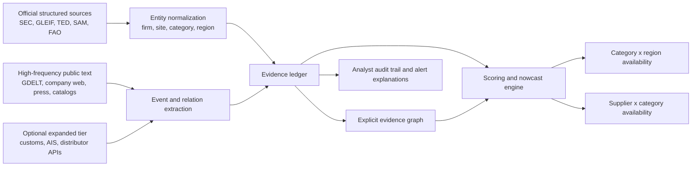
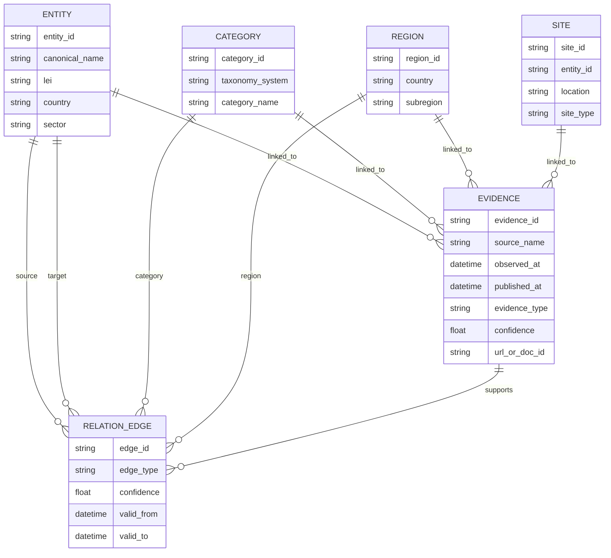
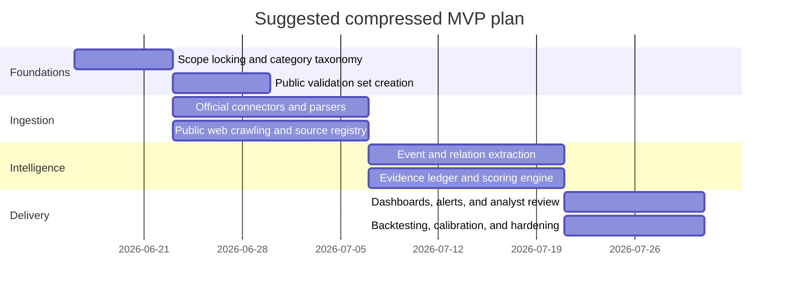

# Technical report for an MVP hybrid nowcast and evidence ledger for industrial B2B supply availability

## Executive summary

This report evaluates whether a high-rigor MVP can be built for **industrial B2B supply-availability nowcasting** across **components, chemicals/materials, and food/agri**, with primary outputs at **product or category × region availability** and **supplier or company × category availability**. The scope, ranking criteria, cadence, and delivery assumptions follow the user brief and clarifications. fileciteturn0file0

The central conclusion is that the **best MVP under the stated constraints** is **not** a full end-to-end reconstructed global supply-chain graph. It is a **hybrid nowcast plus evidence ledger** built from: **official or near-official structured data** where available, **high-frequency public text signals** from news and company web sources, **explicit relation extraction** for supplier-category and supplier-customer evidence, and a **lightweight evidence-backed graph layer** that stores only provenance-backed edges rather than aggressively hallucinating missing links. This design scores highest when balancing methodological viability, public-data viability, compute and budget feasibility, and legal or licensing risk. citeturn46academia1turn46academia2turn46academia3turn12academia15turn33view2turn6view0turn29view2turn31view1

The strongest **public-only** sources are: SEC EDGAR filings for listed firms and foreign issuers filing with the SEC; GLEIF LEI data and mappings for global entity normalization; TED and SAM.gov for public procurement demand and supplier signals; GDELT for multilingual global event streams updated every 15 minutes; Common Crawl and direct public web crawling for company pages and catalogs; FAO statistics for agrifood production, trade, prices, inputs, and food-security context; and derived open trade platforms such as OEC for implementationally easier access to Comtrade-like trade structures. These are enough to build a credible early-warning MVP, but they produce **uneven supplier-depth coverage**, especially for private firms, deep-tier suppliers, and many chemicals or materials markets where transaction-level public visibility is sparse. citeturn6view0turn32view2turn29view2turn30view2turn33view2turn35view4turn36view0turn27view0turn52search4

Once the scope is expanded to **semi-public and attainable licensed sources**, the most valuable additions are **commercial customs or bills-of-lading datasets**, **AIS and maritime intelligence feeds**, and **vertical distributor or aggregator APIs** for electronics and some industrial categories. These do not fundamentally change the recommended architecture, but they materially improve supplier coverage, freshness, and confidence scoring. In other words, **part B improves the same architecture** rather than justifying a different one. citeturn52search0turn42view0turn31view2

The evidence base supports the recommended hybrid design better than any single-method alternative. Supply-chain knowledge-graph work shows clear value for resilience analysis and missing-link prediction, but the strongest published results still depend on **partially curated networks**, **domain-bounded corpora**, or **synthetic scenarios**, which means that **input availability**, not model class, is the binding constraint for a public-data MVP. The literature therefore supports using graph methods as a **structured memory and propagation layer**, while treating broad graph reconstruction as a **phase-two or phase-three objective** rather than the MVP itself. citeturn46academia1turn46academia0turn46academia2turn46academia3turn12academia15

The recommended MVP stack is therefore: **source ingestion**, **entity normalization**, **taxonomy alignment**, **event and relation extraction**, **evidence ledger**, **mixed-frequency signal fusion**, **availability scoring**, and **explainable alerting**. For technology choices, the highest-fit open stack is a **small-footprint analytical store around DuckDB and Parquet**, a **search and retrieval layer such as OpenSearch**, and an **optional property-graph store such as Neo4j only when the explicit evidence graph grows beyond what simple relational joins and materialized views can comfortably support**. citeturn43search3turn45search2turn44search2turn44academia1

## Framing hypotheses and validation status

The research can be organized around six practical hypotheses.

**Hypothesis one** was that a **public-only** system can already deliver useful nowcasting for **category × region** availability. This is **supported**. Public event streams, procurement notices, company filings, public company websites, and official agrifood statistics provide enough signal to estimate disruptions, tightening, and recovery at category-region level, even if they do not reveal the full underlying network. The statistical nowcasting literature also supports using mixed-frequency, lagged, and partially missing data streams in real time. citeturn33view2turn29view2turn6view0turn27view0turn49search1turn48search1turn48search2

**Hypothesis two** was that a public-only system can also provide useful **supplier × category** availability estimates. This is **partially supported**. It works relatively well for listed firms, procurement-active firms, firms with public catalogs or supplier pages, and sectors with public distributor data, but coverage falls sharply for deep-tier private suppliers and opaque process industries. In the reviewed literature, graph completion helps on incomplete supply-chain graphs, but those graphs still need a substantial seed of known entities and relations. citeturn46academia1turn32view2turn30view2turn29view2turn42view0

**Hypothesis three** was that a **full graph reconstruction MVP** is the right first step. This is **rejected for MVP scope**, though not for the long run. Full reconstruction offers compelling downstream value, but under small budget, strict compute limits, and no internal benchmark, it adds too much entity-resolution burden, too much hidden-edge uncertainty, and too much benchmarking difficulty relative to a direct hybrid nowcast plus evidence ledger. citeturn46academia1turn46academia0turn44academia0

**Hypothesis four** was that adding **attainable semi-public data** would materially improve the system. This is **supported**. In practice, the biggest jump comes from customs and maritime data, then from vertical inventory or parts APIs, not from replacing the modeling core. This improves the supplier-category layer more than the category-region layer. citeturn52search0turn42view0turn31view2

**Hypothesis five** was that **social and gray-area data** should be a main pillar because of timeliness. This is **rejected for core MVP design** and **supported only as a comparator layer**. Timeliness can improve, but platform restrictions, legal uncertainty, and higher false-positive rates make such data inappropriate as the backbone of a production-first evidence system. Common Crawl’s terms explicitly warn that crawled content may remain subject to separate third-party terms and strongly counsel legal caution for downstream use. citeturn36view1turn36view0

**Hypothesis six** was that the best architecture is a **hybrid** of explicit evidence extraction plus a lightweight graph plus a mixed-frequency nowcast layer. This is **supported** most strongly across the literature and the source landscape. The research on semantic supply-chain disruption frameworks, supply-chain knowledge graphs, and domain-focused disruption prediction all converge on the value of structured heterogeneous evidence rather than a single model family. citeturn46academia2turn46academia1turn46academia3turn12academia15

The practical validation logic for these hypotheses used **public ground truth and proxy benchmarks** because no internal benchmark is available. The best public validation assets are: explicit supplier and customer mentions in SEC filings; procurement awards and entity records in TED and SAM.gov; public company supplier lists and product catalogs; lagged trade or agrifood statistics for category-region directionality; and manually curated event windows around known disruptions. These are sufficient for **precision and calibration testing**, though not for proving complete network recall. citeturn6view0turn29view2turn30view2turn27view0turn52search4

## Ranked approach landscape

The most useful comparison is not among isolated algorithms, but among **approach bundles** that combine data, extraction, scoring, and explanation.

| Approach bundle | Primary target | Methodological viability | Input viability public-only | Input viability expanded tier | Technical feasibility under constraints | Legal and licensing risk | Overall rank | Why |
|---|---|---:|---:|---:|---:|---:|---:|---|
| **Hybrid nowcast + evidence ledger + explicit evidence graph** | category × region **and** supplier × category | 5 | 4 | 5 | 5 | 4 | **1** | Best balance of rigor, explainability, and buildability; leverages public APIs and text while keeping graph ambition bounded. citeturn46academia1turn46academia2turn46academia3turn12academia15turn33view2 |
| **Expanded-tier hybrid nowcast + evidence ledger + customs/AIS/distributor APIs** | same as above, higher supplier depth | 5 | 3 | 5 | 4 | 3 | **2** | Best raw performance path once modest licensing is allowed; architecture unchanged, coverage improves materially. citeturn52search0turn42view0turn31view2 |
| **Category-region index only** | category × region | 4 | 5 | 5 | 5 | 5 | **3** | Easiest MVP and strongest public-only viability, but weaker supplier-level diagnosis and actionability. citeturn33view2turn27view0turn49search1 |
| **Full graph reconstruction + graph completion / GNN** | full supplier network | 3 | 2 | 4 | 2 | 3 | **4** | High strategic upside, but input sparsity and benchmarking difficulty make it a poor first build. citeturn46academia1turn46academia0turn44academia0 |
| **Social-first weak-signal monitor** | very early alerts | 2 | 2 | 3 | 4 | 1 | **5** | Can be fast, but low reliability and high platform/legal fragility make it unsuitable as the core system. citeturn36view1 |

The ranking changes slightly when separating the two target outputs. For **category × region availability**, the lightest robust system is a **nowcast index fed by official statistics, procurement, event streams, and company web evidence**; graph methods improve explanation and propagation but are not essential. For **supplier × category availability**, the explicit evidence graph becomes much more valuable because the task depends on maintaining a provenance-backed memory of who supplies what, who produces where, and which categories each firm touches. citeturn29view2turn30view2turn32view2turn33view2turn27view0

The same logic explains why **full graph reconstruction should be deferred**. Its main advantages are multi-tier dependency analysis, structural criticality analysis, and alternative-path simulation. Those are real strengths. But the MVP requires fast, defensible answers, and the direct path to that is to **store only explicit and confidence-scored relations**, then propagate disruption evidence through that partial graph. That preserves interpretability and keeps false positives tractable. citeturn46academia1turn46academia2turn44academia0

## Data-source access and viability

The practical source question has to be answered in two tiers: **fully public** and **expanded semi-public**.

### Public-first source inventory

| Source | Purpose and main contribution | Most needed for | Access | Cost | License, limits, or constraints | Access complexity | Notes | Primary source |
|---|---|---|---|---|---|---|---|---|
| **SEC EDGAR APIs** | Public filings, segment hints, supplier/customer mentions, facility and risk disclosures for listed firms and foreign issuers filing with SEC | supplier × category, validation | REST JSON, bulk ZIP | Free | No auth; automated access must comply with SEC policy; coverage biased to filers | Low | Strong precision source, weak global private-firm recall | citeturn6view0 |
| **GLEIF LEI data and API** | Global entity normalization, ownership links, issuer metadata, mappings to other IDs | all approaches | API, downloadable files | Free | Open data; LEI-centric coverage, mostly legal entities with LEIs | Low | Crucial for entity resolution and de-duplication | citeturn32view2turn31view0 |
| **GLEIF OpenCorporates mapping** | Bridge from LEIs to broad corporate-registry identifiers | supplier × category, graph support | CSV download, biweekly update | Free | Mapping coverage partial but large; depends on underlying registries | Low | Strongly improves cross-source joins | citeturn32view4 |
| **TED** | EU and associated-region procurement demand, supplier awards, CPV categories, linked open data | category × region, supplier × category, validation | Anonymous search API, direct downloads, bulk XML, CSV, linked open data/SPARQL | Free | Fair-use policy; mostly above-threshold public procurement | Low | One of the best public supplier-demand signals available | citeturn29view2turn29view1 |
| **SAM.gov** | U.S. entity information, exclusions, federal contracting context, entity data files and APIs | supplier × category, validation | Public search, data files, APIs; some sensitive views require sign-in or federal role | Free | Some public entity info only; restricted views for federal users | Low to medium | Valuable U.S. entity normalization and procurement proxy | citeturn30view2turn28view5 |
| **GDELT 2.0** | Global multilingual event stream, themes, locations, organizations, mentions, emotions | category × region nowcast, weak-signal alerts | CSV lists, BigQuery, codebooks | Free | Event extraction noise and media bias; best used as one signal among several | Low | Near-real-time updates every 15 minutes; 65-language monitoring | citeturn33view2turn33view1turn33view3 |
| **Common Crawl plus first-party web crawling** | Company websites, catalogs, product pages, supplier lists, public PDFs | supplier × category, graph support | HTTP/S download, indexes, AWS open dataset | Free | Separate third-party site terms may still apply; respect robots and legal boundaries | Medium | Essential for private-firm coverage, but operationally messy | citeturn35view4turn36view0turn36view1 |
| **FAO Statistics and FAOSTAT ecosystem** | Agrifood production, bilateral trade detail, prices, fertilizers, pesticides, food-security variables, earth observation links | food/agri category × region | Web portals and statistical dissemination | Free | Country reporting lags remain; not a direct transaction feed | Low | Best official public backbone for food/agri tactical layer | citeturn27view0turn24view0 |
| **OEC and similar Comtrade-derived access layers** | Easier trade exploration, cleaned HS/SITC trade structures, some subnational and recent national customs views | category × region | Public website and derived access | Free to public use of site | Derived source, not primary statistical authority | Low | Good implementation shortcut when official API access is cumbersome | citeturn52search4 |
| **Public company websites and press releases** | Plant outages, expansions, startup delays, sanctions, customer wins, supplier changes | all approaches | Direct crawl or feed | Free | Coverage and format vary widely; legal and robots checks required | Medium | High-value, high-variance source family | citeturn35view4turn36view1 |

The most important takeaway from the public tier is that it is **good enough for early warning**, especially when the task is framed as **nowcasting changing availability conditions** rather than recovering every hidden transaction. The public tier is strongest when the system asks: *Is supply for category X in region Y tightening, loosening, or at risk, and which named firms have the strongest public evidence of exposure?* It is much weaker when the system asks: *Which private tier-three supplier in Southeast Asia is upstream of this specific resin or subassembly?* citeturn33view2turn27view0turn46academia1

### Expanded semi-public tier

| Source family | What changes relative to public-only | Access mode | Cost | Main gains | Main risks or limits | Confidence |
|---|---|---|---|---|---|---|
| **Commercial customs and bills-of-lading feeds** | Major improvement in supplier discovery, route visibility, importer-exporter linking, and deep-tier inference | API, exports, account access | Usually quote-based; public pricing often not posted | Biggest single lift for supplier × category coverage | Licensing, redistribution limits, geography gaps, data-cleaning burden | High that value is large; medium on exact access terms |
| **AIS and maritime intelligence feeds** | Better vessel, port, congestion, routing, and shipment delay signals | API, dashboards, archives | Freemium to commercial; satellite or archive access typically paid | High value for petrochemicals, minerals, agri bulk, and ocean freight | Coverage asymmetries, provider dependence, price opacity | Medium to high | 
| **Electronics and industrial distributor APIs** | Direct stock, lead-time, MOQ, alternates, and catalog coverage in some verticals | Registration-only API or commercial integration | Often free to access basic search, commercial for scale or feeds | Very high value for electronic components and some industrial categories | Vertical-specific; poor fit for many chemicals and upstream materials | High for components, low for broad industrial materials |
| **Registration-only platforms and portals** | Better structured access than raw scraping for some public-in-principle datasets | Account plus terms acceptance | Usually low to none | Lower operational burden | TOS dependencies, account fragility | Medium |
| **Licensed benchmarks and curated mappings** | Stronger evaluation and entity joining | File license or benchmark access | Low to moderate | Better benchmarking and label quality | Not production inputs by themselves | Medium |

For maritime data specifically, public materials indicate that MarineTraffic provides a basic free service while more advanced satellite and historical capabilities are paid, which is directionally representative of the wider AIS vendor market. That makes AIS a classic **expanded-tier** source: very valuable, but usually not truly open. citeturn52search0turn52search2

For electronics, device and part aggregators can materially strengthen an MVP in categories where **inventory, lead time, price ladder, and alternates** are publicly surfaced. Public materials on Octopart indicate that the platform aggregates pricing, availability, datasheets, and related content, and exposes data through APIs and integrations. This is highly useful for electronics, but much less transferable to bulk chemicals and many process materials. citeturn42view0

### What this means for public-only versus expanded tiers

The architecture does **not** have to change between the two tiers. What changes is the **coverage and confidence** of the supplier-level graph and the **freshness and directness** of logistics signals. Public-only remains the correct starting point because it already supports a defensible evidence ledger and a useful category-region nowcast. The expanded tier should be viewed as a **coverage amplifier**, not as the core methodological breakthrough. citeturn46academia1turn33view2turn52search0turn42view0

## Recommended MVP methods and auxiliary stack

The most viable method stack has five core layers.

### Evidence-backed entity resolution and taxonomy alignment

The first requirement is a robust way to decide that different mentions refer to the same firm, site, product family, or region. The strongest public building block is the **GLEIF LEI layer**, because it provides canonical legal-entity identifiers, ownership links, mapped identifiers, and an API that supports fuzzy name and address search. For procurement-driven demand signals, TED provides CPV-coded procurement concepts and SAM.gov provides entity and classification context for U.S. federal suppliers. In practice, the MVP should normalize firms into a canonical entity table and then attach source-specific aliases, LEIs, procurement identifiers, and company-domain evidence. citeturn32view2turn31view0turn29view2turn30view2

This method is mature and high-value because almost every downstream error in supply monitoring is actually an **identity resolution error** masquerading as a forecasting error. Build-over-buy is favored here. The public data already supports a strong baseline, and buying entity data too early would raise cost without solving the hardest downstream modeling issues. citeturn31view0turn32view4

### Event extraction and evidence scoring

The second layer extracts **events** and **claims** from text, such as plant shutdowns, strikes, sanctions, export controls, logistics disruptions, quality incidents, demand spikes, and procurement awards. GDELT is valuable because it already supplies global event and theme metadata at high frequency, but it should not be the whole extraction layer. A better design is to combine GDELT with direct parsing of company pages, filings, and procurement notices, then write every extracted claim into an evidence ledger with source, timestamp, entity links, category links, confidence, and claim type. citeturn33view2turn33view3turn29view2turn6view0

Methodologically, the literature favors this heterogeneous setup. MARE shows that semantic integration of distributed disruption data is useful for monitoring, assessment, and recovery. SHIELD shows that schema-driven disruption extraction can outperform simpler baselines in a domain-specific setting. The 2026 agentic monitoring paper reports very high task-level performance and low cost, but because its evaluation is mainly on synthesized scenarios, it should be taken as evidence that the approach class is promising rather than as proof of ready-made external validity. citeturn46academia2turn46academia3turn12academia15

A build-over-buy strategy is again preferred for the MVP. The logic and scoring should remain transparent and configurable. Commercial risk-intelligence feeds can be added later as extra signals, but the system’s core value comes from the **ledger and scoring design**, not merely from a feed subscription. citeturn46academia2turn33view2

### Mixed-frequency nowcasting and signal fusion

The third layer turns heterogeneous evidence into an availability score. This layer should not start with heavy deep learning. It should start with a **mixed-frequency scoring framework** inspired by established nowcasting practice: official lagged series, high-frequency events, procurement signals, shipping or traffic signals if available, and stable structural priors all contribute with different weights, decay, and reliability multipliers. A Kalman-filter or dynamic-factor style approach is methodologically well grounded, while simpler weighted models are easier to ship under strict compute limits. MIDAS-style and dynamic-factor nowcasting literatures both support this mixed-frequency fusion logic. citeturn48search1turn48search2turn49search1

This is where the recommended MVP should be opinionated: **use scalar scores, confidence intervals, and narrative evidence traces before using large black-box forecasters**. Tactical 3–6 month outlooks can then be layered on top using slower-moving structural inputs such as trade, agrifood, procurement, and macro indicators, but the MVP’s primary value remains nowcasting and alerting. citeturn27view0turn49search1

### Explicit evidence graph and limited propagation

The fourth layer stores the extracted network in an explicit graph. The MVP should create edges such as **company produces category**, **company supplies customer**, **company operates site**, **site in region**, **region exposed to event**, and **category proxy-demand elevated by procurement**. Crucially, these edges should be **provenance-backed**, confidence-scored, and revisable. This graph is not yet a grand reconstruction of the world; it is a compact operational memory for structured reasoning and impact propagation. citeturn46academia1turn46academia2

This explicit-graph approach is strongly favored over immediate graph completion. The supply-chain KG literature supports graph completion as a later capability, but the published gains depend on already having a meaningful graph to complete. Under MVP conditions, the best use of the graph is therefore **reasoned propagation on known links**, not speculative completion of unknown ones. citeturn46academia1turn46academia0

### Deferred graph completion and link prediction

Graph completion, GNNs, and related link-prediction methods belong in the roadmap, not the MVP core. The reviewed resilience KG paper reports a best mean reciprocal rank of **0.4377**, which is meaningful but still far from watertight for operational truth. That is good enough to inform analyst exploration and candidate-edge generation, but not good enough to become the core evidence basis of a production MVP where clients will want named, auditable reasons for an alert. citeturn46academia1

### Auxiliary stack and how it connects

| Stack component | Role in system | Best fit in MVP | Why it fits here | Connected data and methods | Source |
|---|---|---|---|---|---|
| **DuckDB with Parquet** | Analytical store, local OLAP, reproducible feature building | Core | Embedded, OLAP-oriented, Parquet-friendly, strong for low-cost batch analytics | source snapshots, feature tables, validation sets, score backfills | citeturn43search3 |
| **OpenSearch** | Search, filtering, fast retrieval, alert retrieval, optional vector search | Core | Good fit for text-centric retrieval and monitoring dashboards | evidence search, document retrieval, matching company or category evidence | citeturn45search2 |
| **Neo4j or similar property graph** | Optional graph persistence and traversal | Optional after first milestone | Useful once explicit evidence graph becomes central for propagation and analyst queries | company-category edges, site-region edges, event impact exploration | citeturn44search2turn44academia1 |
| **Scrapy-class crawling layer** | Structured crawling of company sites and public pages | Core if direct crawling is used | Strong open-source fit for controlled, repeatable crawls | company pages, catalog pages, supplier pages, press releases | citeturn45search0 |
| **Official source connectors** | Reliable ingestion from EDGAR, GLEIF, TED, SAM, GDELT, FAO | Core | Highest-confidence way to reduce parser brittleness and legal exposure | official structured feeds and bulk files | citeturn6view0turn32view2turn29view2turn30view2turn33view2turn27view0 |

The key architectural point is that the **evidence ledger is the center of gravity**, not the graph database. The graph is a view over the ledger. This keeps the system explainable, easier to audit, and easier to maintain if licenses or sources change. citeturn46academia2turn46academia1

## MVP conceptual implementation plan

The recommended MVP is a **public-first, explainability-first** build that deliberately limits ambition in the network layer and concentrates on high-value early warning.

This architecture is directly motivated by the source and methods landscape reviewed above: official APIs lower ingestion risk, GDELT supplies timeliness, public web extraction expands private-firm coverage, the evidence ledger stores provenance, and the graph remains lightweight and explicit rather than speculative. citeturn6view0turn32view2turn29view2turn30view2turn33view2turn35view4turn46academia1turn46academia2

A minimal evidence-ledger schema can be represented as follows.

That schema is intentionally simple because the hard problem is not schema design but maintaining **auditable joins** between entities, categories, and evidence. This is also the right design for later graph promotion into a dedicated graph database if needed. citeturn46academia1turn44academia1

The implementation should proceed in four pragmatic workstreams.

The plan assumes roughly six to eight weeks of focused execution, but the order matters more than the exact duration. If time is tighter than that, the correct cut is to **start with category × region only**, while still building the evidence ledger in a way that can later support supplier × category views. citeturn49search1turn46academia2

The validation plan should be explicit from day one. A solid public benchmark set would include: named supplier or customer mentions from SEC filings; TED and SAM procurement links; known category disruptions from major public events; and a manually reviewed set of category-region outcomes validated against lagged trade or agrifood statistics. Report metrics should include event precision and recall, entity-resolution accuracy, alert lead time, score calibration, and explanation completeness. The benchmark should explicitly separate **publicly observable truth** from **unobservable hidden-edge truth** so the system is not unfairly judged on impossible labels. citeturn6view0turn29view2turn30view2turn27view0

## Appendix

### Detailed method fit by use case

| Method | Best use | Scope and boundary | Maturity | Build versus buy |
|---|---|---|---|---|
| **Rule-heavy extraction with schema-bound LLM verification** | Fast MVP event and relation extraction | Best when evidence needs traceability; weaker on novel unseen schemas without supervision | High practical viability | **Build**; retain prompts, heuristics, and confidence logic in-house |
| **Dynamic-factor or weighted mixed-frequency nowcast** | Category × region scoring | Best for stable, updateable scalar nowcasts; not a causal simulator | High theoretical maturity | **Build** with simple, auditable implementation first |
| **Explicit provenance graph** | Supplier × category memory and impact propagation | Excellent for explanation and partial network reasoning; not a hidden-edge oracle | High practical viability | **Build** from ledger; buy only if graph serving becomes a bottleneck |
| **KG completion / GNN** | Candidate-edge suggestion and scenario analysis | Valuable after there is a sizable explicit graph and benchmark | Medium | **Defer**; do not make this the MVP core |
| **Social or gray-area weak-signal layer** | Comparator-only early hints | Use only behind strict filtering and never as sole evidence | Low for core production use | **Avoid as core**, optional comparator later |

The most important build-versus-buy principle is this: **buy data when it visibly increases coverage; build logic when it determines trust**. For this problem, trust is created by source provenance, confidence scoring, and explanation quality. Those are strategic differentiators and should remain internal. Coverage enhancers such as customs, AIS, and vertical inventories can be bought later when the ledger and score engine are already stable. citeturn46academia1turn46academia2turn12academia15turn52search0turn42view0

### Full graph reconstruction viability

A full graph reconstruction remains strategically attractive because it enables multi-tier exposure tracing, structural criticality analysis, bottleneck centrality, and alternative sourcing simulations. The reviewed literature does support these use cases. But reconstruction requires solving five hard problems simultaneously: hidden-edge discovery, stale-edge retirement, entity disambiguation, category mapping, and benchmark construction. Under public-only conditions, those problems dominate runtime and quality more than model choice does. citeturn46academia1turn46academia0turn44academia0

For that reason, the most defensible recommendation is to **reconstruct a bounded graph of explicit evidence-backed relations first**, then assess whether graph completion adds sufficient incremental value on top of that. This sequencing protects the MVP from becoming a technically elegant but operationally unverifiable graph project. citeturn46academia1turn46academia2

### Open questions and limitations

Several important details remain incomplete. Public research and official documentation were sufficient to rank the major approach families with confidence, but **exact commercial pricing** for many customs, AIS, and distributor or platform datasets was often not posted publicly, so those rows should be treated as directional rather than procurement-ready. Likewise, sources on **UN Comtrade operational API access** were harder to retrieve directly in the reviewed material than derived access layers such as OEC, so the report uses OEC as an implementation-friendly proxy in some places rather than claiming a complete current Comtrade developer review. citeturn52search4

The evidence base is also asymmetric. There is strong methodological support for semantic integration, mixed-frequency nowcasting, and partial supply-graph reasoning, but there is less public, high-quality, fully external validation for truly global, cross-industry supplier reconstruction from public data alone. That limitation is itself an important finding: it strengthens the case for the **hybrid nowcast plus evidence ledger** path and weakens the case for a graph-first MVP. citeturn46academia1turn46academia2turn46academia3turn12academia15